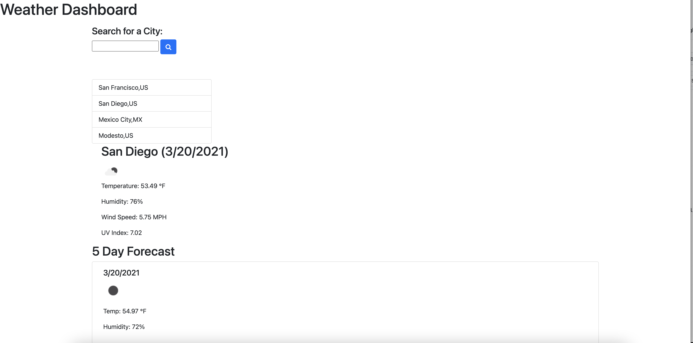

# wheaterDashboard

WeatherDashboard is a website to show you the weather of the city, country state searched.

## Features

Weather Dashboard has Today's Forecast with the following features 

```
City Name, today's date and specific weather icon
Temperature
Humidity
Uv 
```
It will also provide you with the next five days  with the same feature mention above

## Search History

Search History will display the 10 most recent search locations and it will provide the information when clicking the location searched. 

## Technologies Used

<ul>
    <li>HTML/CSS/Javascript</li>
    <li>Bootstrap </li>
    <li>JQuery</li>
    <li>Open Weather API
    </li>
</ul>

## License
[MIT](https://choosealicense.com/licenses/mit/)

## Screen Shoot


